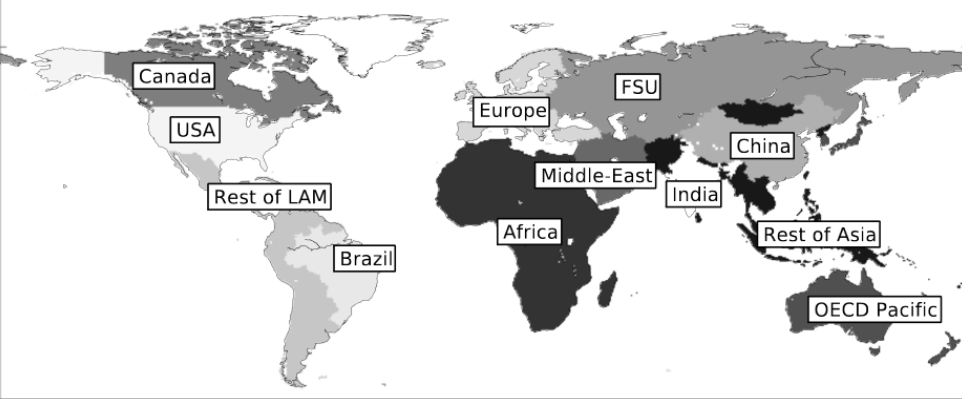

# Calibration data for the electricity nexus of the IMACLIM-R model

## General architecture of the data

The data in csv format is either 1x1 matrix or a 12x1 matrix. When data is 1x1, the value corresponds to the world estimate. Regional estimates are presented in a 12x1 matrix. The order of appearance for the twelve IMACLIM-R regions in the following:
1) United States of America
2) Canada
3) Europe
4) OECD Pacific
5) Former Soviet Union
6) China
7) India
8) Brazil
9) Middle East
10) Africa
11) Rest of Asia
12) Rest of Latin America

## List of the available technologies, with their full name, short name and description

| Short name        | Full name     | Dispatchable?| Description |
|--------------|-----------|:------------:|------------|
|SUB  | Sub-critical coal    |   X     |  |
|PFC     | Supercritical coal|    X    |  |
|USC    | Ultra supercritical coal|     X  |  |
|ICG   |Integrated coal gasification in combined cycle|    X   |  |
|PSS     | Supercritical coal with sequestration|     X   |  |
|UCS   | Ultra Supercritical coal with sequestration|    X    |  |
|ICG   |Integrated coal gasification in combined cycle with sequestration|  X     |  |
|GGT   |Gas turbine|   X    |  |
|GGC|Combined cycle gas turbine|    X   |  |
|OCT|Oil-powered turbine|   X    |  |
|OGT|Combined-cycle oil-powered turbine|   X    |  |
|HYD|Conventionnal large-size hydro|   X    |  |
|NUC|Conventionnal large-size nuclear reactor|   X    |  |
|CSP|Concentrated solar power|   X    |  |
|WND|Onshore wind turbine|      |  |
|WNO|Offshore wind turbine|      |  |
|CPV|Large-scale PV|      |  |
|RPV|Rooftop PV|      |  |
|BIGCC|Biomass integrated gasification combined cycle|   X   |  |
|BIGCCS|Biomass integrated gasification combined cycle with sequestration|   X   |  |

## Usual assumptions
